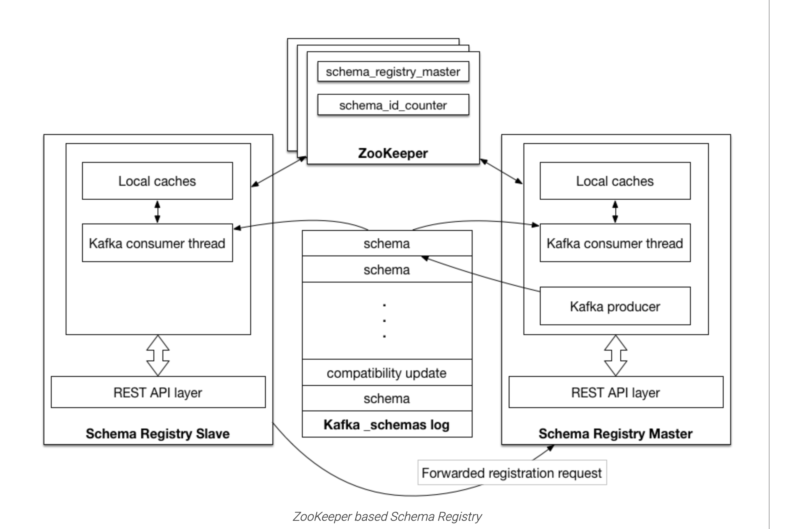

# 1 背景

这个问题是流水线上的1个flaky case，因为流水线资源比较紧张，平时的失败大家有时候都懒得去看具体的堆栈，直接点重试。

这次有点时间挖掘下其中的原因。

# 2 排查

我们项目中用到了schema registry，为了测试schema registry的不同认证方式，我们启动了3个实例。

- 实例1：监听http://0.0.0.0:8081
- 实例2：监听https://0.0.0.0:8082
- 实例3：监听https://0.0.0.0:8083，同时配置ssl.client.auth=true，也就是需要双向校验证书

可以看出，这3个实例的安全性是逐渐提高的。

同时我们在测试中有3个case，分别是

- 无证书，请求实例1
- 只配置了ca证书，请求实例2
- 既配置了ca证书，又配置了client证书，请求实例3

流水线上报错的是第1个case，具体的报错是这样的：

```
REST request failed(code -1): HTTP request failed: Couldn't connect to server
```

看起来很像是资源不足，schema registry server没启动成功，导致连接失败。

但是实际登上机器查看，发现3个实例都是正常运行的。

查看实例1的日志，发现有forward request to https://0.0.0.0:8083类似的日志(具体的日志找不到了，反正大概是这个意思)，

也就是说发往实例1的请求实际上被转发到了实例3，而因为测试case1并没有client证书，所以当然请求失败。

具体再看实例3的日志，发现实例3被选为leader了，也就是说实际上3个节点自动组成了一个集群，而请求被转发到了leader实例3。

那么为什么会自动组成一个集群？

我们是部署的较老版本的schema registry，还是借助zookeeper进行节点发现和选举的，因为都连着同一个zookeeper，而且没有指定namespace，都用的默认的namespace，所以都注册到了zookeeper的相同路径上就组成集群了。



那么测试为什么有时成功有时失败？

如果实例1被选为leader，那么应该就是成功的；如果实例2或3被选为leader，那么应该就是失败的；

基于zookeeper进行的选举一般是先到先得，我们启动时按照实例1、2、3的顺序，也就是实例1率先启动大概率会是leader，但是其实3个实例谁先启动完成并注册到zookeeper是没有保证的。

# 3 问题解决

可以通过为3个实例指定不同的namespace来防止他们组成集群。

参考：https://docs.confluent.io/platform/current/schema-registry/installation/config.html#schema-registry-zk-namespace