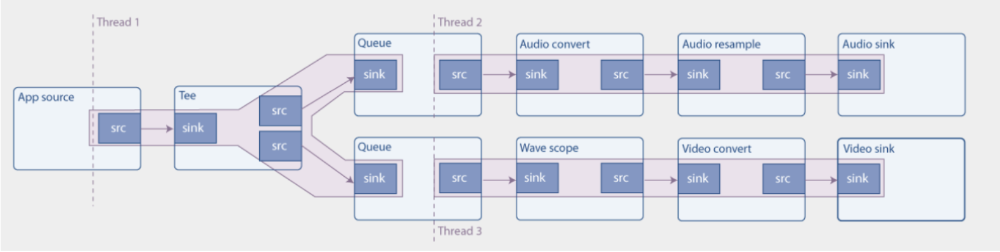

# 0 前言

一个特别风骚的流媒体框架，1999年设计开发，至今仍然活跃，基于内核-插件的架构思想，nvidia的deepstream也有其插件。

# 1 hello world

- gst_init (&argc, &argv) ：初始化gstreamer

- gstreamer是处理流媒体的框架，媒体数据从source传到sink，经过一系列任务，组成pipeline

- gst_parse_launch：根据string类型的流水线表达式直接生成pipeline对象，gst-launch-1.0就是调用它实现的

- playbin：它既是source又是sink，自己就能组成完整的pipeline。内部实现会自动组合需要的元素播放文件；可接受参数uri

- gst_element_set_state(pipeline GST_STATE_PLAYING)：相当于启动pipeline

- gst_element_get_bus(pipeline)：获取bus对象？

- gst_bus_timed_pop_filtered (bus, GST_CLOCK_TIME_NONE,GST_MESSAGE_ERROR | GST_MESSAGE_EOS)：阻塞等待bus，一直到

  报错或者流结束EOS

- 资源释放，基于引用计数进行gc

  - gst_message_unref
  - gst_object_unref
  - gst_element_set_state(pipeline,GST_STATE_NULL)：都要释放了还改它干啥？
  - gst_object_unref(pipeline)

# 2 concepts

- gst_element_factory_make("videotestsrc","source1")：创建元素、名字；
  - videotestsrc产生测试视频数据
  - autovideosink接受并播放数据
- gst_pipeline_new("test-p")：创建pipeline
- gst_bin_add_many(GST_BIN(pipeline),source,sink,NULL)：pipeline是GST_BIN类型，可包含其他元素
- gst_element_link(source,sink)：将source和sink连接起来，数据将从source流向sink
- 各种element都是GObject对象，可用g_object_get()获取对象，用g_object_set()设置对象；
- GstBus：负责传递流水线中的元素产生的消息（流水线的执行是在另外的线程中，利用bus可以同步获得消息）

# 3 dynamic pipelines

- demux：解析包含视频和音频的容器文件，将视频、音频分割开来

- GstPad：GstElement之间交互信息的通道；包括sink和source两种，sink指的是流入，source为流出；

  - source element只包含source pad
  - sink element只包含sink pad
  - filter element既包含source pad又包含sink pad

- demuxer包含1个sink和2个source

  - 1个sink接受容器格式的媒体数据
  - 2个source分别为audio source和video source，分别输出音频和视频数据

- demuxer的复杂之处在于未接收到数据时，是没有source pad的，只有读入数据时，才动态的创建source pad，因此需要动态创建流水线

- g_signal_connect (data.source, "pad-added", G_CALLBACK (pad_added_handler), &data)：注册信号回调，第一个参数为产生事件的

  对象，第二个参数为事件类型；

- gst_element_get_static_pad(convert,"sink")：获取元素的pad对象，此处是获取sink

- gst_pad_is_linked：pad是否跟别的pad连接了，可用于防止重复link

- 获取pad类型

  - get_pad_get_current_caps(new_pad)
  - gst_caps_get_structure(caps)
  - gst_structure_get_name(struct)：如果是audio/x-raw前缀则是音频pad

- pipeline状态

  - NULL
  - READY
  - PAUSED：数据可流入，但是不流出（阻塞）
  - PLAYING：数据正常流入

# 4 time management

- 当前媒体是否支持seek需要用GstQuery获取，比如直播流不支持seek

- gst_bus_timed_pop_filtered (bus, 100 * GST_MSECOND,...)：与之前的区别在于添加了超时时间，因此当返回时，可能是因为触发了事

  件，也可能是达到了超时。类似select。

- gst_element_query_position：获取当前的位置（时间进度）

- gst_element_query_duration：获取总时长

- gst_element_seek_simple：

  - GST_SEEK_FLAG_FLUSH：立即清空当前缓存的数据，也就是停止处理当前数据，直接seek跳到指定位置
  - GST_SEEK_FLAG_KEY_UNIT：跳到最近的关键帧，并直接继续（直接定位到的时间点可能无法独立解码，需依赖关键帧）；如果不设置，也是跳到关键帧，但是会等时间到了设置的seek位置才继续（更准确但是会卡一下）

# 5 GUI integration

图形界面集成，不是很重要

# 6 Media formats and Pad capabilities

- pad允许数据的流入和流出，而pad上的caps决定了什么样的数据可以流入、流出；比如RGB video、h264等
- 可以将两个pad连接在一起的条件是他们的caps存在交集；caps存在多种，实际数据流入时只会有一种格式，元素之间通过协商确定格式；

# 7 Multithreading and Pad availability

- tee元素：一个sink，多个src，作用为将接受到的数据复制多份分别发送到多个src
- queue元素：queue的sink负责入队，另启一个线程出队push到src；可用作buffer，size可设置

示例将1个音频，经tee复制，传到了2个queue。上边的queue最终进行音频播放，下边的queue将音频转化为可视化的波纹视频播放。

- pad类型：

  - Sometimes：例如uridecodebin，不总是生效，但是当数据流入时会自动创建

  - Always

  - Request：例如tee，需要几个src需要根据它的template请求创建，src_%u，创建出的pad依次为src_0，src_1

- gst_element_get_request_pad(tee,"src_%u")：请求pad
- gst_pad_link(tee_audio_pad,queue_audio_pad)：将tee的一个src pad与queue的sink连接起来

# 8 Short-cutting the pipeline

- appsrc pad：提供数据（从app获取）
  - 拉模式pull：定期从app请求数据
  - 推模式push：app主动推数据，可通过enough-data和need-data信号做流量控制
- appsink pad：推送数据到app
- Buffers
  - GstBuffer可能包含多个GstMemory
  - 在流水线之间流动的数据块被组织为Buffer
  - source pad产生buffer，sink pad消费buffer每个buffer带时间戳和持续时间，描述了数据的解码、渲染、展示时间
  - 举例：
    - filesrc产生ANY caps Buffer；
    - demux之后，产生video/x-h264 caps Buffer；
    - decode后，每个buffer包含1个视频帧，video/x-raw-yuv caps Buffer
- GMainLoop：Glib提供的事件循环
  - g_idle_add((GsourceFunc)push_data,data)：当mainloop idle时（没有更高优的task则会执行push_data回调）
  - g_source_remove：从mainloop中移除function
- g_signal_emit_by_name(data->app_source,"push-buffer",buffer,&ret)：通过push-buffer信号向appsrc推送数据
- g_signal_emit_by_name(sink,"pull-sample",&sample)：通过pull-sample从sink拉取数

# 9 Media information gathering

GstDiscoverer实现，可以根据指定uri获取media信息

# 10 GStreamer tools

- gst-launch-1.0：目前em使用gstreamer的主要入口。根据文本输入构建流水线

  - gst-launch-1.0 videotestsrc pattern=11! videoconvert ! autovideosink：各个组件之间用感叹号连接，可设置属性
  - gst-launch-1.0 videotestsrc ! videoconvert ! tee name=t ! queue ! autovideosink t. ! queue ! autovideosink：利用name=t，构建了分叉的pipeline

- 指定pad

  - gst-launch-1.0 souphttpsrc location=https://www.freedesktop.org/software/gstreamer-sdk/data/media

    ! matroskademux name=d d.video_0 ! matroskamux ! filesink location=sintel_video. /sintel_trailer-480p.webm

    mkv：因dumux产生2个output pads，video_0和audio_0，可以用d.video_0指定与下一个元素连接的pad

- caps filter

  - gst-launch-1.0 souphttpsrc location=https://www.freedesktop.org/software/gstreamer-sdk /data/media/sintel_trailer-480p.webm ! matroskademux ! video/x-vp8 ! matroskamux ! filesink location=sintel_video.mkv：通过video/x-vp8过滤视频

- gst-inspect-1.0：列举所有插件/某个插件的详细信息，可根据pads和caps判断两个插件是否可以连接到一起

# 11 Debugging tools

指定某个元素的日志级别，可用通配符

GST_DEBUG=2,audiotestsrc:6

GST_DEBUG_DUMP_DOT_DIR可将流水线示意图导出至指定目录

# 12 Streaming

- 流式media的特点
  - 从网络接受数据，解码并处理，如果数据delay了，整体会卡顿
  - 一般的做法是添加buffer，缓冲一些数据，可以容忍一段时间的delay
- 直播(live)不使用buffer
  - 尝试更改live media的状态时会得到GST_STATE_CHANGE_NO_PREROLL
- 如果有多个sink（比如音频sink和视频sink），使用全局时钟来同步，GStreamer会从所有元素中挑选能提供时钟的元素来作为全局时钟。
- 如果流切换或输出设备变更，时钟可能会丢失
- 全局时钟丢失时，触发GST_MESSAGE_CLOCK_LOST事件，此时需切换到PAUSED再切换回PLAYING来重新获取时钟

# 13 Playback speed

- Step Events
  - 可以跳过某些帧，只对流水线上的某个元素生效
- Seek Events
  - 可以跳到指定位置，修改速率(1：正常；2：2倍速；-1：倒放)等，对流水线上的所有元素生效

# 14 handy elements

- playbin：根据uri自动适配的播放器
- uridecodebin：根据uri格式自动适配的demux
- decodebin：根据uri自动适配的decoder，直到解析出raw数据
- filesrc：读取本地文件
- filesink：写入本地文件
- souphttpsrc：http source
- videotestsrc：自动生成视频数据，测试用
- audiotestsrc：自动生成音频数据，测试用
- videoconvert：
  - 用于上下游元素的协商，会自动将上游的数据转化为下游能接受的格式，比如RGB到YUV
  - 如果上下游可以直接对接，则可以不用它
  - 当格式不确定时，最好加上它
  - 即使上下游可以直接对接，把它放在中间，对性能消耗也极小，因此总而言之，最好加上它
- videorate：
  - 通过复制帧或者丢弃帧来匹配指定的fps
- videoscale：
  - 调整视频帧的长宽
- queue：多线程，生产者/消费者模式
- queue2：可将数据保存到磁盘上，queue在 内存中
- mutiqueue：同时处理多个流，多个queue根据流的收发情况自动调节大小
- tee：复制一份输入到多份输出