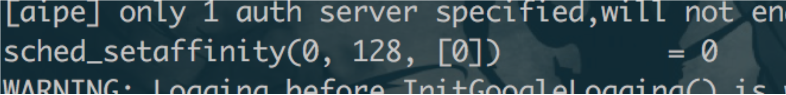
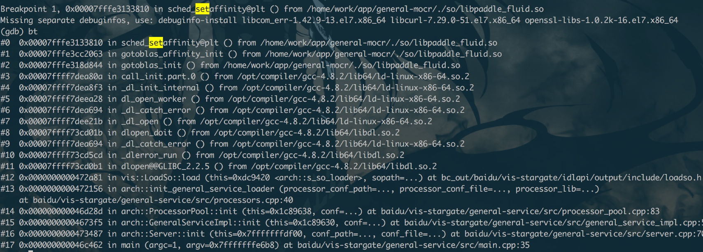

# 1.背景

客户实际私有化部署OCR服务的cpu版本时，发现cpu的利用率比较低，只能到100%，也就是说只能利用单核，导致压测性能上不去。

# 2.排查

首先怀疑是docker对容器的资源进行了限制。

查看相关文档之后，发现docker是可以对容器的cpu资源进行限制，但是默认是不做限制的。

参考文档：https://docs.docker.com/config/containers/resource_constraints/。

到容器中进行验证后，发现只有ocr的服务是只能用单核的，而其他的服务则都可以使用宿主机所有cpu。

用cat /proc/1/status查看了一下ocr进程的cpu affinity设置，发现被绑定到了cpu 0，初步猜想是ocr服务在代码中进行了设置。

进一步用strace和gdb查看是否存在对sched_setaffinity的系统调用，发现确实存在：

# 3.修复

到容器中，用taskset命令重新设置ocr进程的cpu affinity，

taskset -a -p -c 0-24 1

- -a选项，表示对该进程下的所有线程生效。

- -c 0-24，cpu序号

- 1，容器内ocr服务的进程号

设置完后的状态：

设置完后压测时cpu使用率：

# 4.后续

问了下OCR服务相关的开发，他们也说没见过这种现象，但是可以去研究下是否是local_cpu_map()在不同环境下的行为不一致。

https://docs.rs/crate/openblas-src/0.5.0/source/source/driver/others/init.c

有空了后续再研究一下...