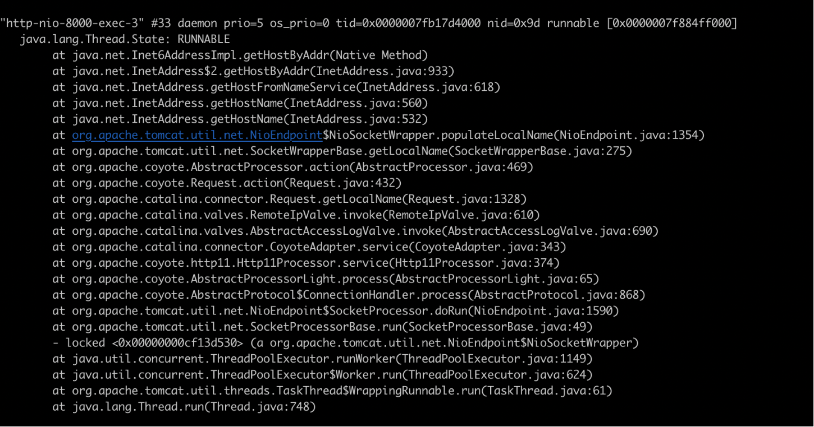
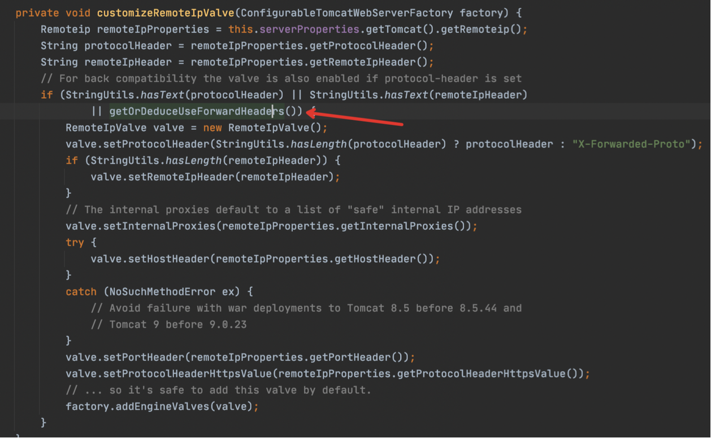
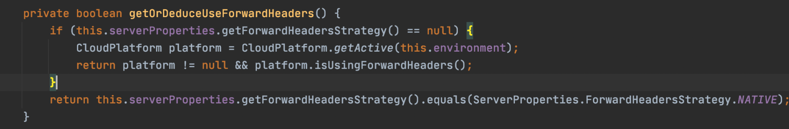
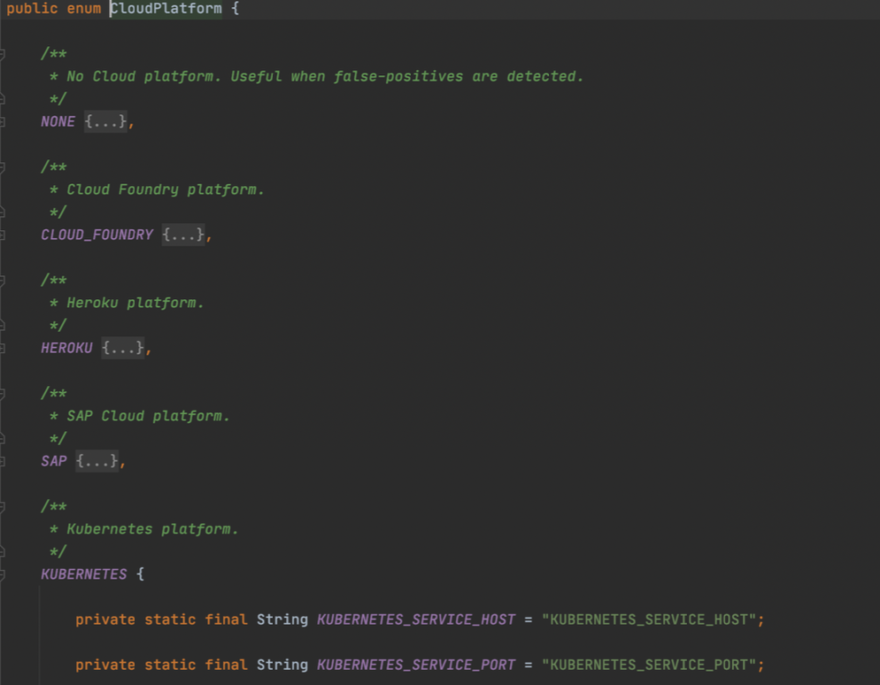

# 1.背景

服务部署到边缘设备k3s环境后，发起首次访问时，会卡顿很长时间，后续的请求正常。而当同一个窗口快速刷新或再开一个浏览器tab访问时，又会发生卡顿。

这种现象在本地和docker中都未出现。

# 2.排查

首先同时发送多个请求，用jstack查看堆栈，观察处理请求的线程，看它们卡在哪个地方。

从图上可以看出，是卡在getHostByAddr方法，顺着堆栈找，入口是RemoteIpValve。

本地想尝试下断点看下执行流程，因此在RemoteIpValve的入口下了断点，但是奇怪的发现，居然没有执行到这个地方。这说明在k3s中执行的逻

辑跟本地执行的逻辑有区别...

于是继续看RemoteIpValve什么情况下会被组装到处理逻辑中..

也就是满足getOrDeduceUseForwardHeaders()的才会在执行流程中加入RemoteIpValve。

因为我们没有配置forwarding-header-strategy，因此应该是走了上半部分逻辑，进行了云平台的检测。

可以看出CloudPlatform中有对k8s的检测，是通过判断有无环境变量KUBERNETES_SERVICE_HOST和KUBERNETES_SERVICE_PORT来做的。

而k3s作为k8s的简版，也是具有这两个变量的。

所以springboot判断出了我们的运行环境是k8s，所以自动添加了RemoteIpValve的执行逻辑。那具体又为什么会卡在getHostByAddr方法呢，是因为在边缘设备上运行时，dns服务也出了些问题，/etc/resolve.conf配置了192.168.1.253，但是实际上该dns服务不可用（公司内是可用的，出公司就不可用了...），所以导致失败。

至于为什么只有首次请求卡顿？是因为这个解析是以一个socket为单位的，也就是一个tcp连接，因此复用一个连接的后续请求就会很快。但是如果快速刷新

或者新开窗口，都会建立新的tcp连接，又会重新走getHostByAddr的逻辑导致卡顿。

# 3.解决办法

- 可以直接在/etc/hosts中加上本机ip的配置，192.168.1.36 my-ubuntu-host，这样可以不走/etc/resolve.conf解析

- 或者去掉/etc/resolve.conf中有问题的nameserver