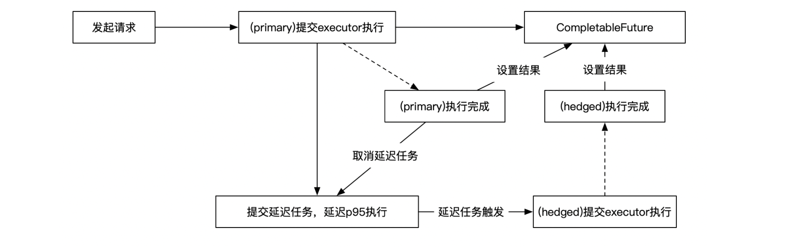

# 1 背景

​        分布式环境下，像这种某个底层服务请求时间变长是比较常见的情形，很难避免，可能根本不是程序层面导致的，比如网络抖动，我们难以控制。我们可以控制的是负载均衡与重试策略，根据我们的业务特点，我们对底层算子的调用，天然满足幂等性，也就是可以任意重试。以上面那个请求为例，一个容易想到的优化是，我们可以同时向两个实例发送请求，哪个请求返回的快，我们就使用哪个请求返回的结果。不过这样会使流量增长为2倍，加大底层服务的压力。

​        因此我们考虑仍然使用原先的重试策略，但是其实第一个请求的超时时间过长了（写死了10s），如果能提前发起重试，整体响应时间可以明显缩短。可以考虑将超时时间设置为该算子P95分位响应时间，比如antiporn 95%的请求都在200ms内返回，那么当前antiporn请求超过200ms没响应时，我们即可向另一个实例发起重试，这样预期流量只会增加5%。这种方法又叫对冲请求（hedged request），微博的rpc框架motan称之为双发机制，详细可以看下：https://medium.com/swlh/hedged-requests-tackling-tail-latency-9cea0a05f577

# 2 p95时间获取

目前平台缺少这部分的统计。

因此我们需要先自己统计一下，考虑先在每个实例的内存中做统计，其缺点是从集群维度看数据可能有偏差。

我们的场景是统计每个api维度最近N分钟内的P95/P99耗时，需要做到本身统计相对准确、写入快、流式统计、内存等资源占用相对稳定。比较下几个常用的Quantile/Histogram库：

| #    | 库             | 优缺点                                                       |
| ---- | -------------- | ------------------------------------------------------------ |
| 1    | Guava Quantile | 不是在线计算的模式，需要把所有数据传进去， 基于类似快排partition的划分方法进行统计 除准确性满足外，其他方面都不是很合适； |
| 2    | Metrics        | 主要看了ExponentiallyDecayingReservoirs和 SlidingTimeWindowArrayReservoir， 会记录下每笔请求的耗时，为了防止请求量过大撑爆内存， 只能设置固定大小的窗口，如果请求太快则不准； |
| 3    | t-digest       | 精确，但速度慢一些；似乎更适合离线场景；                     |
| 4    | HdrHistogram   | 通过划分小区间做计数实现，内存占用量可控； 不那么精确，但精度可控，并发性能符合要求，符合在线场景要求； |

几个对比讨论链接：

- https://caorong.github.io/2016/07/31/hdrhistogram/

- https://medium.com/expedia-group-tech/your-latency-metrics-could-be-misleading-you-how-hdrhistogram-can-help-9d545b598374

- https://github.com/gatling/gatling/issues/1866

# 3 对冲请求发起&取消

- 主要流程说明：
  - 外层发起调用请求
  - (primary)提交executor执行：这是将实际调用委托给executor执行，并拿到一个CompletableFuture
  - 提交延迟任务，延迟p95执行：根据我们统计的p95耗时，设置一个延迟任务，该任务如果不被取消，将在p95的时间后触发
    - (hedged)提交executor执行：如果延迟任务成功触发了，同样提交一个调用任务给executor
    - (hedged)执行完成：将与primary竞争对CompletableFuture的结果进行设置，如果设置成功，说明hedged先于primary完成，说明我们期待的策略生效了；如果设置失败，说明primary已完成，因为每个CompletableFuture仅可被成功设置1次结果，hedged的结果将被忽略，因此无影响
  - (primary)执行完成：执行完成后，将与hedged竞争对CompletableFuture的结果进行设置；并尝试取消延迟任务；

## 3.1 延迟任务

延迟任务实现有2种比较主流的方式：

- 优先队列：代表是jdk的ScheduledThreadPoolExecutor，其内部的DelayedWorkQueue实际上就是优先队列，排序规则是按照任务的延迟时间排序；

- 时间轮：代表是netty的HashedWheelTimer

由于我们的场景会频繁的提交并取消，真正被调度执行的延迟任务只是少数，使用HashedWheelTimer要优于ScheduledThreadPoolExecutor，因为后者要涉及堆结构的调整，而HashedWheelTimer取消延迟任务时只是把自己从链表中移除，是常数时间。实测也是HashedWheelTimer更优一些，可参考单测；

CompletableFutureTest.testDelayQueueVsHashedWheelTimer()

注：ScheduledThreadPoolExecutor有个配置 setRemoveOnCancelPolicy(boolean)用于控制取消任务时，是否立即从优先队列删除任务，默认是不删除，就是因为删除效率不算高；

但是如果不立即删除，队列中会实际存在大量已经被取消的任务。

## 3.2 流量控制

这是一个兜底的策略，代码中根据统计做个开关，保证在任何情况下因对冲请求导致的流量增加至多不超过5%，主要是为了防止如果统计出什么bug导致流量激增把下游打挂。

# 4 上线效果

## 4.1 典型请求分析

分析一个与之前情况类似的典型请求，首先经在线统计，该api的p95时间为330ms。

服务器日志图较敏感，先不放了...

- 线程asyncExecutor-113在10:27:14.311 发起了disgust/detect请求
- 上述请求未在期望时间(p95时间即330ms)内未能返回，asyncExecutor-143在10:27:14.642发起了对冲请求
- 对冲请求在10:27:14.779率先返回了，耗时137ms整体审核流程在10:27:14.780返回，整体耗时472ms
- 线程asyncExecutor-113发起的disgust/detect请求在10:27:24.325返回了（10s超时）

可以看出，如果不存在对冲策略，整体请求耗时会跟原来类似>10s，经对冲策略生效后，整体耗时仅为472ms，即该策略对部分请求确实有明显的改进效果。

## 4.2 统计分析

用我们的日志，对一个小时的情况做一下统计，约5%的请求触发了对冲请求，其中约5‰的请求对冲策略真的生效了（即对冲请求比主请求更快的返回了）。

# 5 后续

这种策略似乎在go的rpc框架里原生支持了，比如kitex的[backup request](https://www.cloudwego.io/docs/kitex/tutorials/service-governance/retry/#backup-request)，确实是用go的话实现起来会更加方便...
