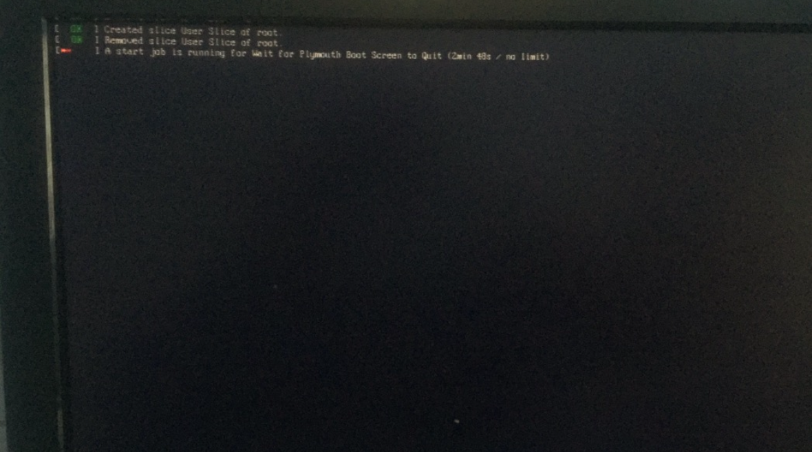
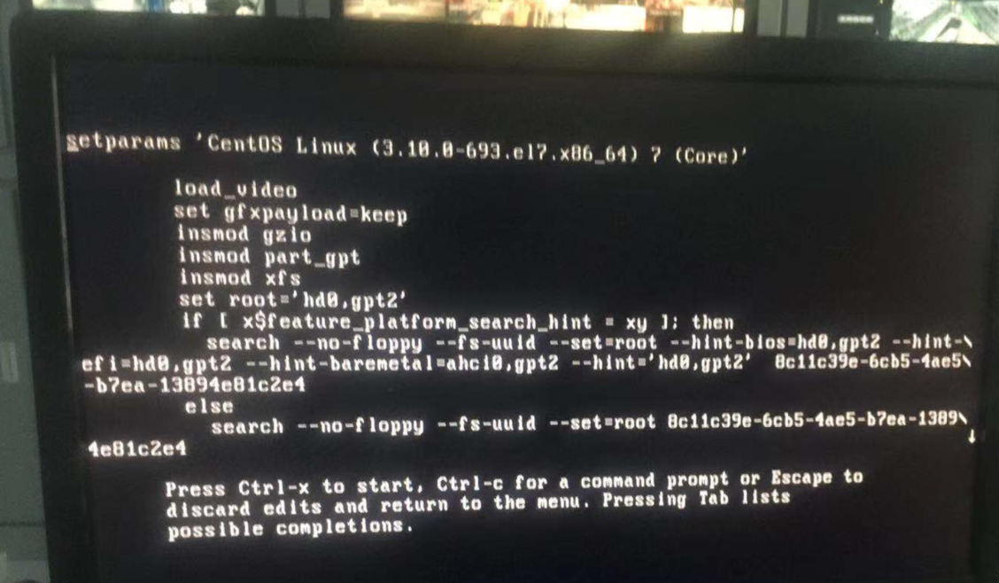
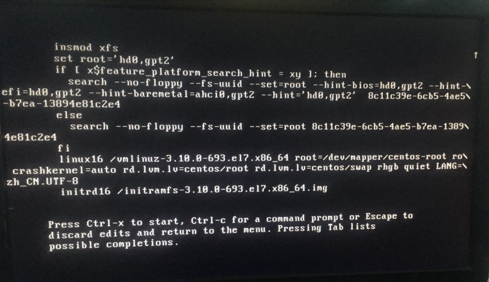
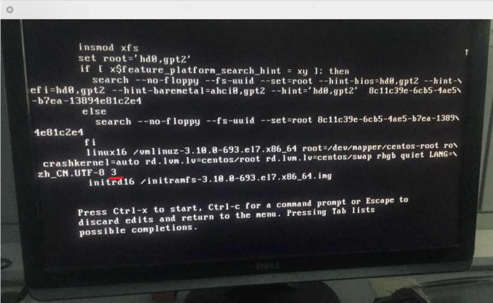
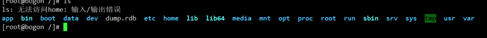
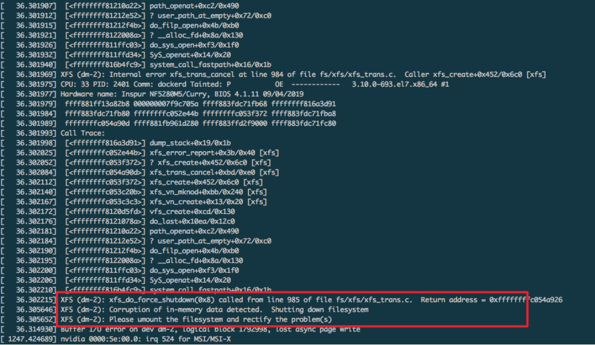
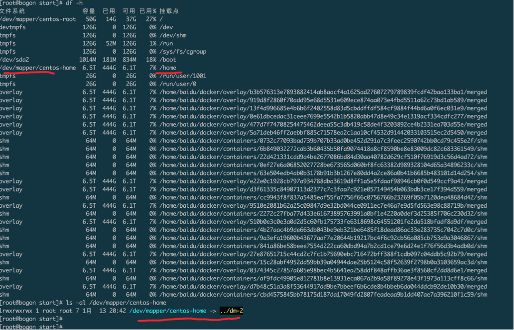

# 1 背景

有个客户经常突然断电，原因未知，导致服务出现各种奇奇怪怪问题...

# 2 断电后无法启动a start job is running for wait for plymouth

## 2.1 问题描述

机器断电，重启后发现无法进入登陆界面。提示如下：

按ctrl+alt+f1也无法进入命令行。

## 2.2 问题排查

经查资料，plymouth与图形界面（X server）有关，可能断电引起一些底层错误，导致无法正常启动图形界面。

因此可以想办法绕过图形界面的启动。

通过查看运行级别相关资料，发现将启动级别调整为3即可绕过图形界面启动。

因为已经无法进入命令行，因此设法在启动时进入grub进行修改。

到grub页面时按键盘e键，进入如下编辑页面：

按方向键向下，直到下图：

在UTF-8的后边加一个3，如下图：

然后按ctrl+x即可。

## 2.3 问题解决

参考上述过程：

- 重启

- grub按e

- utf-8后加3

- ctrl+x

# 3 断电重启后读取/home目录时报错输入/输出错误

## 3.1 问题描述

断电登陆后发现docker无法启动，/home目录不正常，尝试读取其中文件时报错输入/输出错误

如下图：

## 3.2 排查

输入/输出错误，即input/output error，尝试搜索问题后发现可能跟文件系统有关。

查看dmesg，发现设备dm-2关键报错：

dm-2即挂载到/home目录的设备：

先尝试重新mount，发现无效果。

经搜索发现可以先umount，然后用xfs_repair尝试修复，xfs_repair /dev/dm-2。

修复后正常。

## 3.3 问题解决

umount /home

xfs_repair /dev/dm-2

# 4 后续

建议客户整个ups...

# 5 参考链接

- 运行级别：https://zh.wikipedia.org/wiki/%E8%BF%90%E8%A1%8C%E7%BA%A7%E5%88%AB

- plymouth：

  - https://www.unix.com/man-page/centos/8/plymouth/

  - https://forums.centos.org/viewtopic.php?t=47423

- grub修改运行级别：https://www.if-not-true-then-false.com/2012/howto-change-runlevel-on-grub2/
- input/output error：https://unix.stackexchange.com/questions/39905/input-output-error-when-accessing-a-directory
- xfs文件系统：https://zh.wikipedia.org/wiki/XFS
- xfs_repair：
  - http://fibrevillage.com/storage/666-how-to-repair-a-xfs-filesystem
  - https://www.thegeekdiary.com/running-repairs-on-xfs-filesystems/